# 인프런 강의 수집 통계
- 생성 시각(KST): 2026-03-02 03:19:59
- 조회 범위: 최근 365일 (시작일: 2025-03-02 03:19:59)

## Totals
| metric | value |
|---|---|
| distinct course(locale) (latest dim) | 2429 |
| distinct instructors | 617 |
| snapshots (last 365d) | 64044 |

## Locale breakdown (latest)
| locale | courses | students_sum | likes_sum | reviews_sum | avg_star |
|---|---|---|---|---|---|
| ko | 1215 | 2963411 | 2205785 | 51618 | 3.9879 |
| en | 1214 | 2961322 | 2204876 | 51433 | 3.9545 |

## Price & Discount (latest)
| locale | courses | avg_regular_krw | avg_pay_krw | avg_discount_rate | discounted_cnt | discounted_ratio |
|---|---|---|---|---|---|---|
| ko | 1193 | 60611.0 | 57547.0 | 4.1811 | 165 | 0.1383 |
| en | 1130 | 63873.0 | 60639.0 | 4.4018 | 164 | 0.1451 |

## 수집 시점 기준 통계 (snapshot_raw)
### Hourly
| bucket | courses | snapshots | cum_courses | cum_snapshots |
|---|---|---|---|---|
| 2026-03-02 00:00:00+09:00 | 218 | 4193 | 2915 | 64044 |
| 2026-03-01 21:00:00+09:00 | 203 | 3323 | 2697 | 59851 |
| 2026-03-01 18:00:00+09:00 | 225 | 4142 | 2494 | 56528 |
| 2026-03-01 15:00:00+09:00 | 300 | 7200 | 2269 | 52386 |
| 2026-03-01 13:00:00+09:00 | 301 | 7199 | 1969 | 45186 |
| 2026-03-01 10:00:00+09:00 | 157 | 1995 | 1668 | 37987 |
| 2026-03-01 06:00:00+09:00 | 305 | 7202 | 1511 | 35992 |
| 2026-03-01 03:00:00+09:00 | 301 | 7191 | 1206 | 28790 |
| 2026-03-01 00:00:00+09:00 | 302 | 7198 | 905 | 21599 |
| 2026-02-28 21:00:00+09:00 | 301 | 7199 | 603 | 14401 |
| 2026-02-28 18:00:00+09:00 | 302 | 7202 | 302 | 7202 |

### Daily
| bucket | courses | snapshots | cum_courses | cum_snapshots |
|---|---|---|---|---|
| 2026-03-02 | 218 | 4193 | 2568 | 64044 |
| 2026-03-01 | 1747 | 45450 | 2350 | 59851 |
| 2026-02-28 | 603 | 14401 | 603 | 14401 |

### Monthly
| bucket | courses | snapshots | cum_courses | cum_snapshots |
|---|---|---|---|---|
| 2026-03-01 | 1876 | 49643 | 2479 | 64044 |
| 2026-02-01 | 603 | 14401 | 603 | 14401 |

### Yearly
| bucket | courses | snapshots | cum_courses | cum_snapshots |
|---|---|---|---|---|
| 2026-01-01 | 2460 | 64044 | 2460 | 64044 |

## 개설 시점 기준 통계 (course_dim 최신)
### Daily
| bucket | courses | cum_courses |
|---|---|---|
| 2026-02-27 | 6 | 705 |
| 2026-02-26 | 8 | 699 |
| 2026-02-25 | 12 | 691 |
| 2026-02-24 | 6 | 679 |
| 2026-02-23 | 4 | 673 |
| 2026-02-22 | 2 | 669 |
| 2026-02-21 | 2 | 667 |
| 2026-02-20 | 6 | 665 |
| 2026-02-19 | 6 | 659 |
| 2026-02-18 | 4 | 653 |
| 2026-02-15 | 2 | 649 |
| 2026-02-14 | 4 | 647 |
| 2026-02-13 | 2 | 643 |
| 2026-02-12 | 6 | 641 |
| 2026-02-11 | 2 | 635 |
| 2026-02-09 | 8 | 633 |
| 2026-02-04 | 4 | 625 |
| 2026-02-03 | 4 | 621 |
| 2026-02-02 | 6 | 617 |
| 2026-01-31 | 2 | 611 |
| 2026-01-30 | 2 | 609 |
| 2026-01-29 | 2 | 607 |
| 2026-01-28 | 6 | 605 |
| 2026-01-27 | 8 | 599 |
| 2026-01-26 | 4 | 591 |
| 2026-01-25 | 2 | 587 |
| 2026-01-24 | 6 | 585 |
| 2026-01-23 | 4 | 579 |
| 2026-01-22 | 2 | 575 |
| 2026-01-19 | 4 | 573 |
| 2026-01-18 | 6 | 569 |
| 2026-01-16 | 4 | 563 |
| 2026-01-15 | 4 | 559 |
| 2026-01-14 | 4 | 555 |
| 2026-01-13 | 2 | 551 |
| 2026-01-11 | 2 | 549 |
| 2026-01-10 | 4 | 547 |
| 2026-01-09 | 6 | 543 |
| 2026-01-06 | 4 | 537 |
| 2026-01-05 | 4 | 533 |
| 2026-01-04 | 2 | 529 |
| 2026-01-02 | 4 | 527 |
| 2025-12-31 | 2 | 523 |
| 2025-12-30 | 4 | 521 |
| 2025-12-29 | 10 | 517 |
| 2025-12-26 | 6 | 507 |
| 2025-12-24 | 6 | 501 |
| 2025-12-23 | 4 | 495 |
| 2025-12-21 | 2 | 491 |
| 2025-12-18 | 2 | 489 |
| 2025-12-15 | 2 | 487 |
| 2025-12-14 | 4 | 485 |
| 2025-12-11 | 4 | 481 |
| 2025-12-09 | 6 | 477 |
| 2025-12-08 | 4 | 471 |
| 2025-12-07 | 2 | 467 |
| 2025-12-05 | 4 | 465 |
| 2025-12-04 | 10 | 461 |
| 2025-12-03 | 8 | 451 |
| 2025-12-02 | 4 | 443 |
| 2025-12-01 | 4 | 439 |
| 2025-11-30 | 2 | 435 |
| 2025-11-28 | 2 | 433 |
| 2025-11-27 | 6 | 431 |
| 2025-11-26 | 6 | 425 |
| 2025-11-25 | 6 | 419 |
| 2025-11-24 | 4 | 413 |
| 2025-11-22 | 4 | 409 |
| 2025-11-21 | 2 | 405 |
| 2025-11-20 | 4 | 403 |
| 2025-11-19 | 6 | 399 |
| 2025-11-18 | 8 | 393 |
| 2025-11-17 | 4 | 385 |
| 2025-11-16 | 4 | 381 |
| 2025-11-14 | 2 | 377 |
| 2025-11-13 | 8 | 375 |
| 2025-11-12 | 4 | 367 |
| 2025-11-11 | 8 | 363 |
| 2025-11-10 | 4 | 355 |
| 2025-11-07 | 2 | 351 |
| 2025-11-03 | 2 | 349 |
| 2025-11-01 | 2 | 347 |
| 2025-10-29 | 2 | 345 |
| 2025-10-28 | 2 | 343 |
| 2025-10-26 | 2 | 341 |
| 2025-10-25 | 2 | 339 |
| 2025-10-24 | 2 | 337 |
| 2025-10-23 | 10 | 335 |
| 2025-10-20 | 8 | 325 |
| 2025-10-19 | 2 | 317 |
| 2025-10-17 | 2 | 315 |
| 2025-10-15 | 2 | 313 |
| 2025-10-14 | 2 | 311 |
| 2025-10-13 | 2 | 309 |
| 2025-10-10 | 2 | 307 |
| 2025-10-03 | 2 | 305 |
| 2025-10-02 | 4 | 303 |
| 2025-10-01 | 2 | 299 |
| 2025-09-19 | 2 | 297 |
| 2025-09-16 | 2 | 295 |
| 2025-09-15 | 2 | 293 |
| 2025-09-13 | 2 | 291 |
| 2025-09-09 | 2 | 289 |
| 2025-09-05 | 2 | 287 |
| 2025-09-02 | 4 | 285 |
| 2025-08-31 | 2 | 281 |
| 2025-08-26 | 4 | 279 |
| 2025-08-24 | 2 | 275 |
| 2025-08-22 | 2 | 273 |
| 2025-08-14 | 2 | 271 |
| 2025-08-13 | 8 | 269 |
| 2025-08-12 | 2 | 261 |
| 2025-08-05 | 2 | 259 |
| 2025-08-04 | 14 | 257 |
| 2025-08-03 | 2 | 243 |
| 2025-08-01 | 2 | 241 |
| 2025-07-28 | 2 | 239 |
| 2025-07-27 | 2 | 237 |
| 2025-07-26 | 4 | 235 |
| 2025-07-24 | 8 | 231 |
| ... | ... |

### Monthly
| bucket | courses | cum_courses |
|---|---|---|
| 2026-02-01 | 94 | 705 |
| 2026-01-01 | 88 | 611 |
| 2025-12-01 | 88 | 523 |
| 2025-11-01 | 90 | 435 |
| 2025-10-01 | 48 | 345 |
| 2025-09-01 | 16 | 297 |
| 2025-08-01 | 42 | 281 |
| 2025-07-01 | 60 | 239 |
| 2025-06-01 | 57 | 179 |
| 2025-05-01 | 60 | 122 |
| 2025-04-01 | 34 | 62 |
| 2025-03-01 | 28 | 28 |

### Yearly
| bucket | courses | cum_courses |
|---|---|---|
| 2026-01-01 | 182 | 705 |
| 2025-01-01 | 523 | 523 |

## Distributions (latest, top-level)
| metric | count | p50 | p90 | p99 | max |
|---|---|---|---|---|---|
| student_count | 2429 | 153.0 | 3701.0 | 63778.0 | 120084 |
| like_count | 2429 | 109.0 | 1125.0 | 63960.0 | 123627 |
| review_count | 2429 | 10.0 | 101.0 | 445.0 | 2522 |
| average_star | 2429 | 4.800000190734863 | 5.0 | 5.0 | 5.0 |

## 차트
### collected_daily_snapshots.png
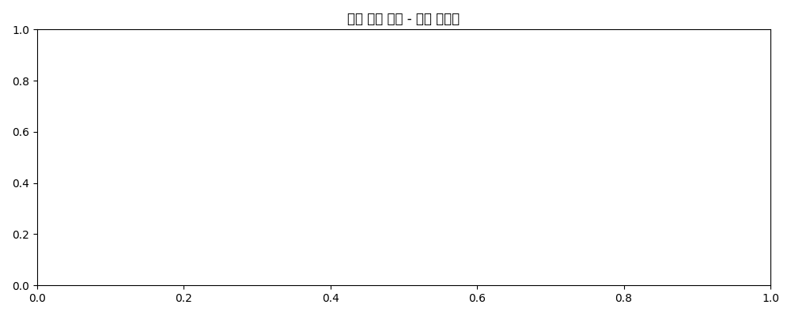

### collected_hourly_snapshots.png
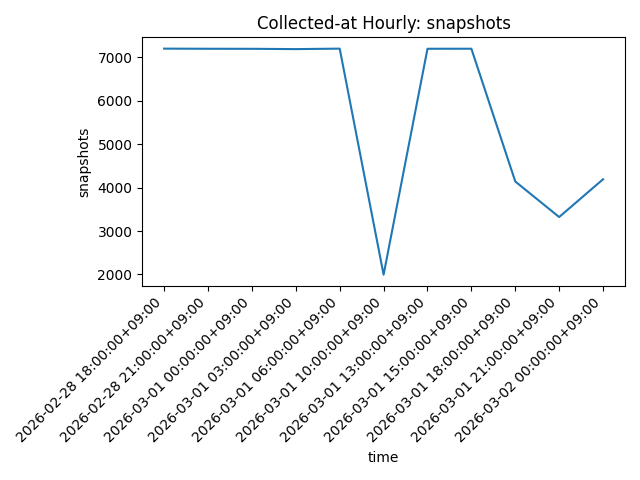

### collected_monthly_snapshots.png
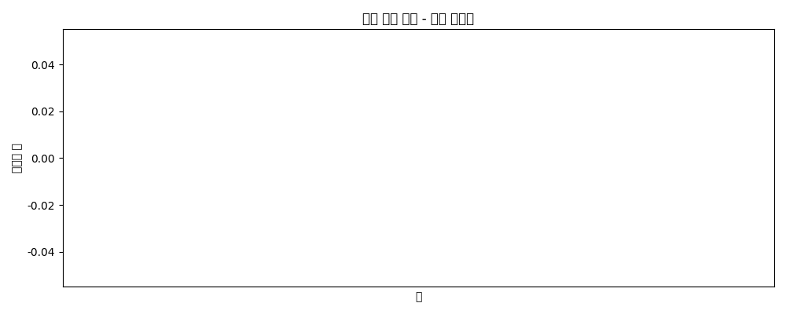

### collected_yearly_snapshots.png
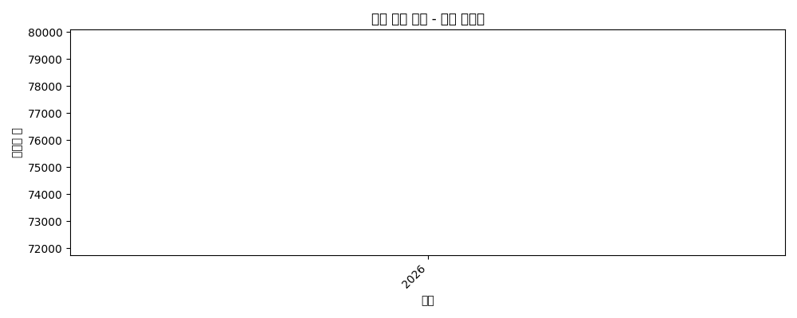

### dist_average_star.png
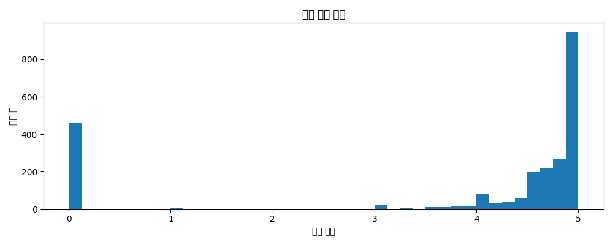

### dist_discount_rate.png
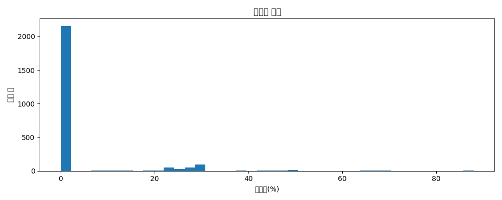

### dist_like_count.png
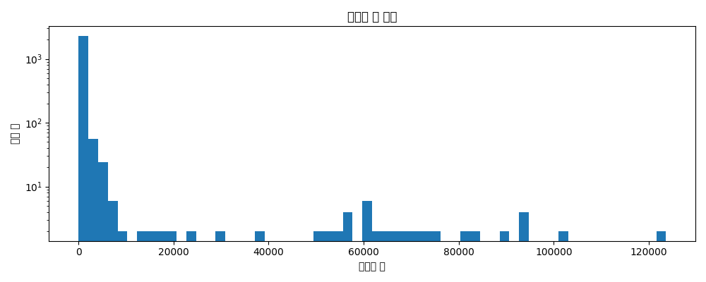

### dist_price_pay_krw.png
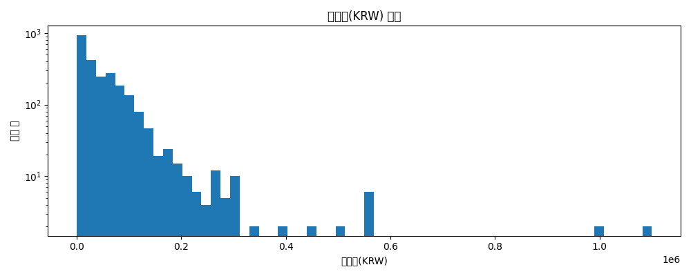

### dist_price_regular_krw.png
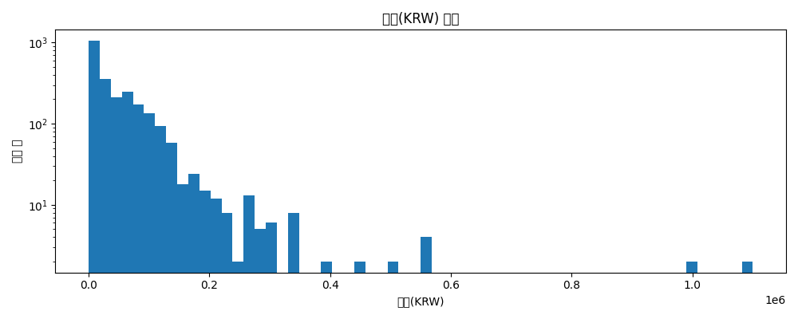

### dist_review_count.png
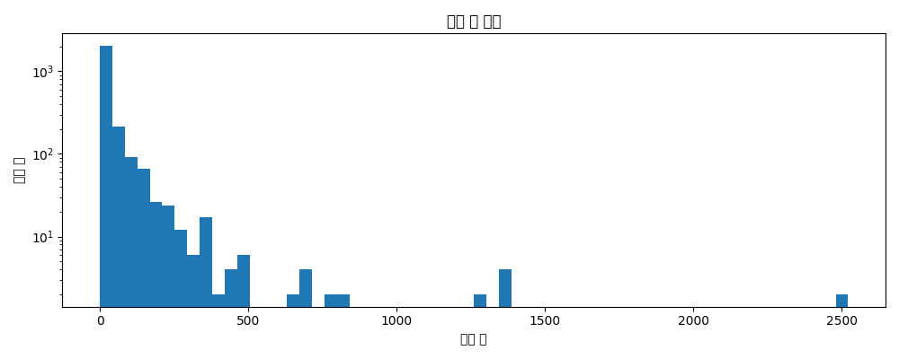

### dist_student_count.png
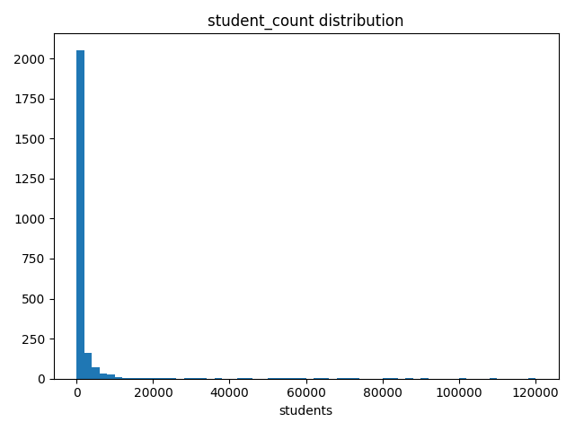

### published_daily_courses.png
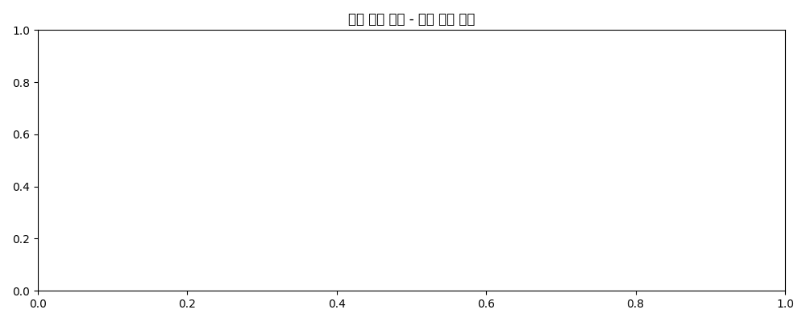

### published_monthly_courses.png
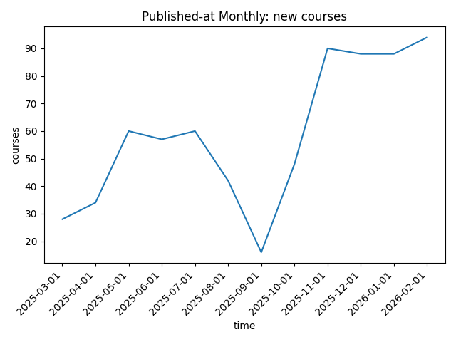

### published_yearly_courses.png
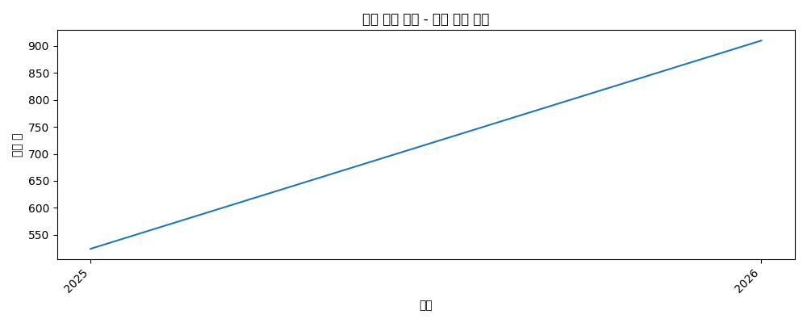
