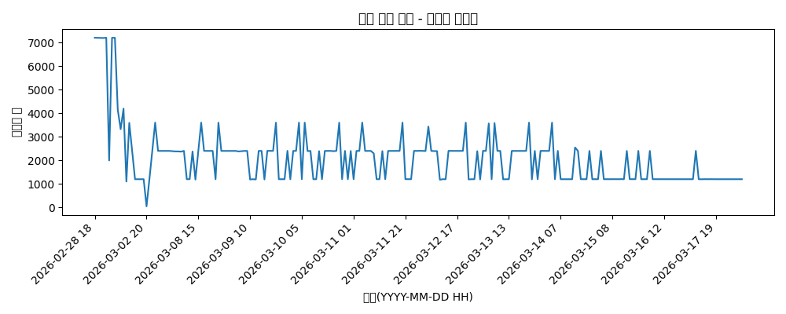
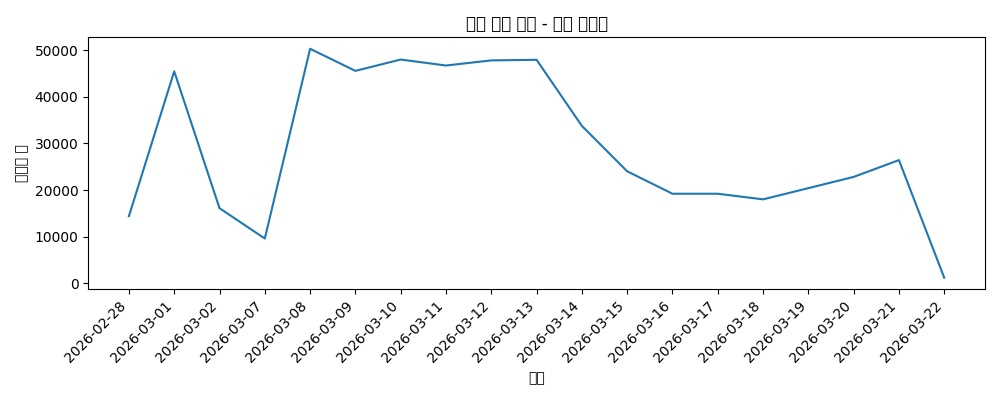
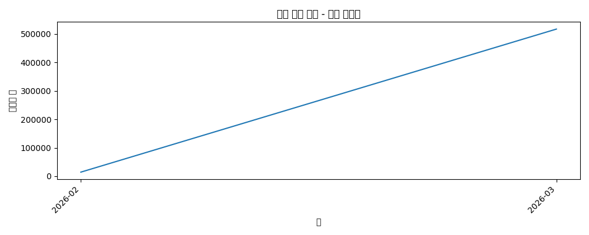
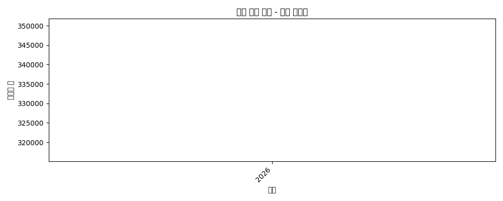
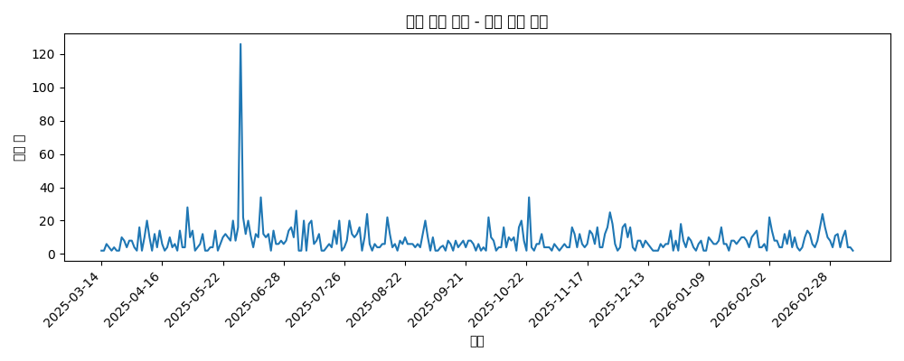
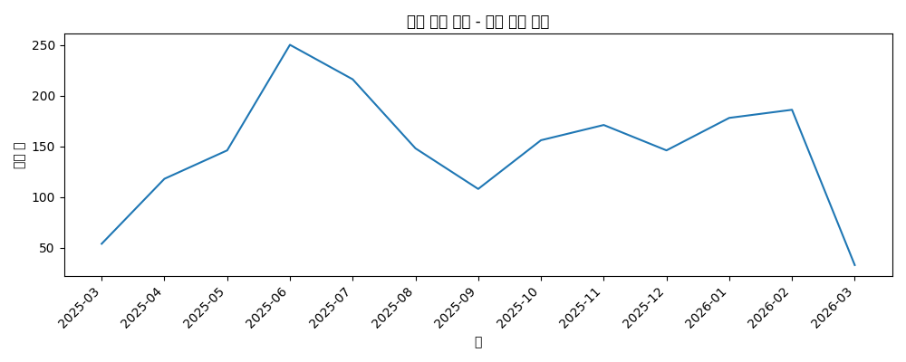
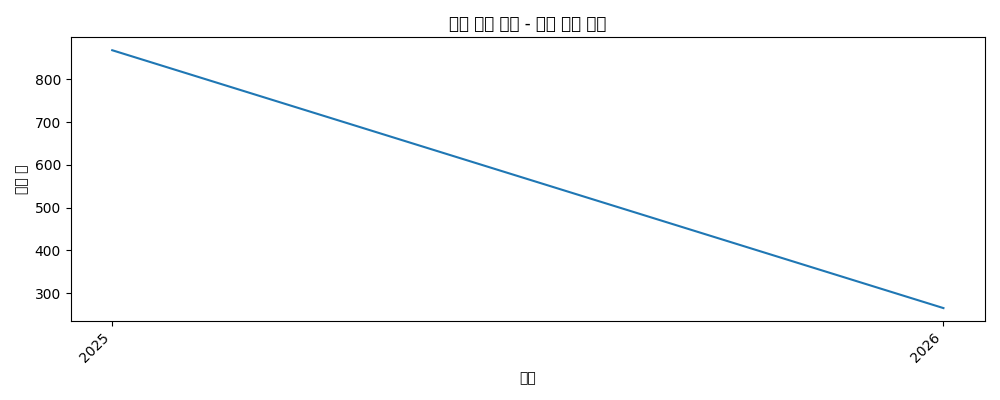

# Inflearn 통계 리포트

- 생성 시각(KST): **2026-03-07 04:48:55**
- 최근 데이터 기준 Lookback: **365일**

## Snapshots by Fetch Hour

- 합계: **75,960**, 마지막: **48**, 피크: **7,202**

## Snapshots by Fetch Day

- 합계: **75,960**, 마지막: **16,109**, 피크: **45,450**

## Snapshots by Fetch Month

- 합계: **75,960**, 마지막: **61,559**, 피크: **61,559**

## Snapshots by Fetch Year

- 합계: **75,960**, 마지막: **75,960**, 피크: **75,960**

## New Courses by Publish Day

- 합계: **1,434**

## New Courses by Publish Month

- 합계: **1,434**

## New Courses by Publish Year

- 합계: **1,434**

## 요약

- 누적 강의 수(고유 course_id): **1,260**

