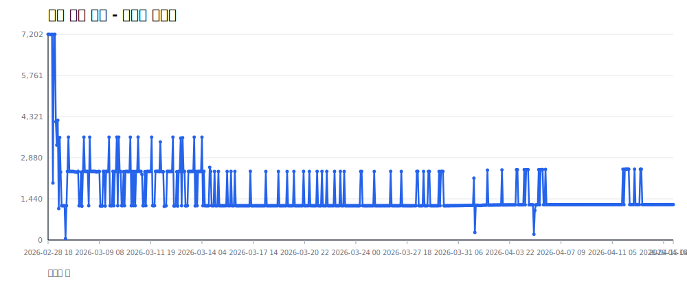
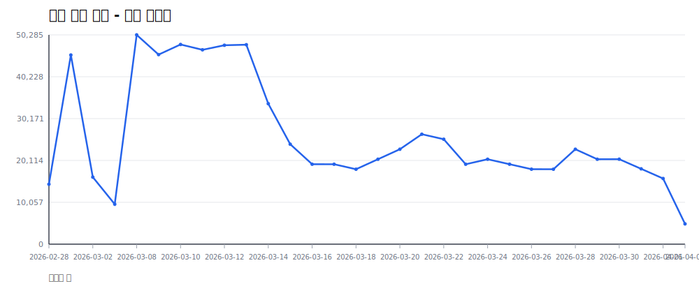
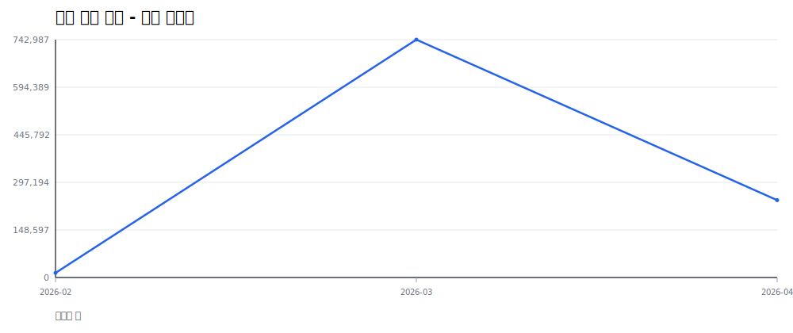
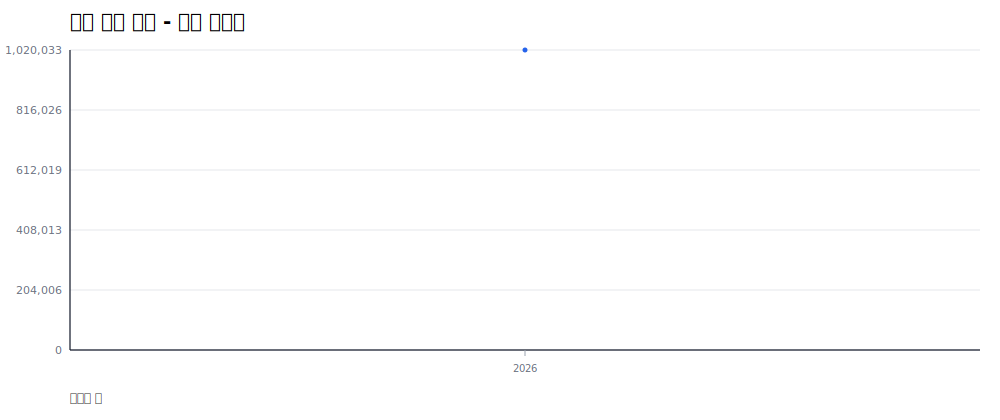
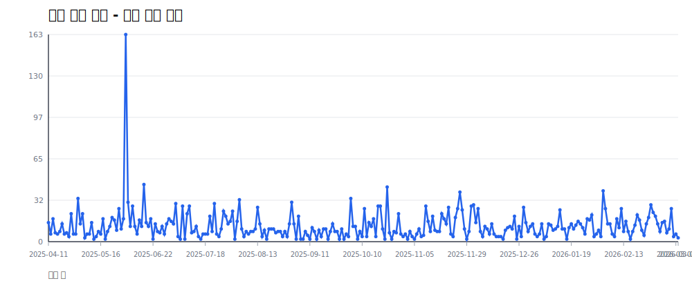
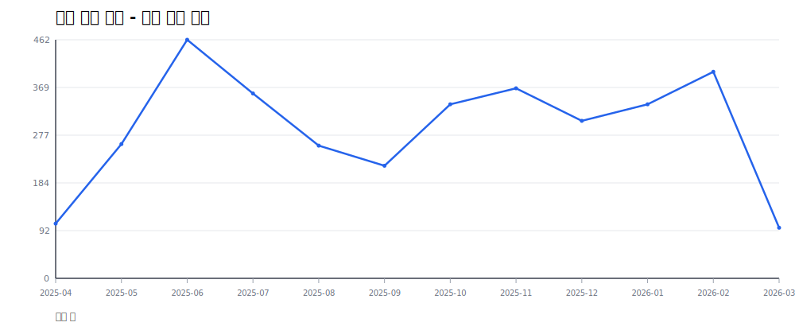
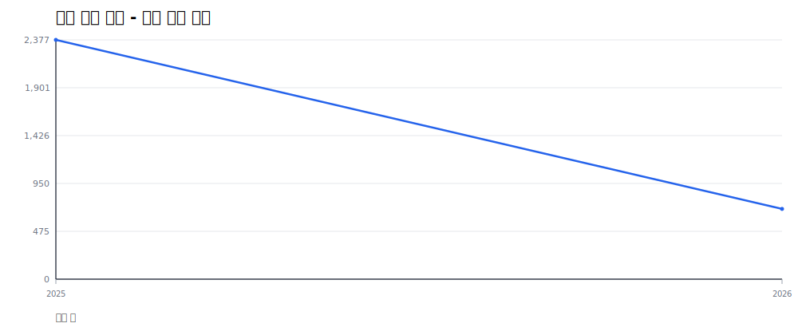

# Inflearn 통계 리포트

- 생성 시각(KST): **2026-04-04 21:44:41**
- 최근 데이터 기준 Lookback: **365일**

## 수집 시점 기준 - 시간별 스냅샷

- 합계: **834,507**, 마지막: **2,464**, 피크: **7,202**

## 수집 시점 기준 - 일별 스냅샷

- 합계: **834,507**, 마지막: **22,150**, 피크: **50,285**

## 수집 시점 기준 - 월별 스냅샷

- 합계: **834,507**, 마지막: **77,119**, 피크: **742,987**

## 수집 시점 기준 - 연별 스냅샷

- 합계: **834,507**, 마지막: **834,507**, 피크: **834,507**

## 개설 시점 기준 - 일별 신규 강의

- 합계: **3,212**

## 개설 시점 기준 - 월별 신규 강의

- 합계: **3,212**

## 개설 시점 기준 - 연별 신규 강의

- 합계: **3,212**

## 요약

- 누적 강의 수(고유 course_id): **4,593**

